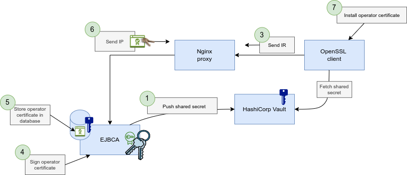

Prerequisites
=============

Install Docker and Docker Compose.
```
sudo apt install docker docker-compose
```

Log in to the PrimeKey registry.
```
docker login registry.primekey.com
```

Manually download binaries for ``jq`` and ``curl`` or run the script:
```
sh ./bin/download_dependencies.sh
```
Run
===

Start the demo with Docker Compose.
```
docker-compose up
```

Create a Configdump
===================

If you have made any changes to the configuration on the CA, you should create a new Configdump.

Export the configuration and move a copy outside the container.
```
docker exec -it (docker ps | grep ejbca-ee | awk '{ print $1 }') /opt/primekey/bin/configdump.sh export -l /tmp/configdump --exclude "CA:ManagementCA,CRYPTOTOKEN:ManagementCA"
docker cp (docker ps | grep ejbca-ee | awk '{ print $1 }'):/tmp/configdump .
sudo chown -R (whoami): configdump
```

Update the placeholders for the passwords.
```
find ./configdump -type f -exec sed -i 's/placeholder/foo123/g' {} \;
```

Demo
====

Enroll With a Shared Secret
---------------------------



Connect to the ``altiostar`` client.
```
docker exec -it $(docker ps --filter label=altiostar --format '{{.ID}}') /bin/sh
```

Create a directory where the keys and certificates will be stored.
```
mkdir /root/ipsec_ran_container
cd /root/ipsec_ran_container
```

Create an RSA keypair for the operator certificate.
```
openssl genrsa -out operator_key.pem
```

Enroll for a certificate with a shared secret from HashiCorp Vault.
```
openssl cmp -cmd ir -server pki -path enroll/container -recipient "/CN=EJBCA" -secret "pass:$(curl -s -H "X-Vault-Token: $VAULT_TOKEN" -X GET http://vault:8200/v1/ran/data/ipsec_ran_container | jq -r .data.data.secret)" -newkey operator_key.pem -subject "/CN=$(hostname)" -extracertsout chain.pem -certout operator_cert.pem -implicit_confirm
```

The CA certificates from the operator's PKI are stored in ``chain.pem`` and the IPSec certificate for the container is stored in ``operator_cert.pem``.

Enroll With Vendor Certificate
------------------------------


Connect to the ``nokia`` client.
```
docker exec -it $(docker ps --filter label=nokia --format '{{.ID}}') /bin/sh
```

Create a directory where the keys and certificates will be stored.
```
mkdir /root/ipsec_ran_airscale
cd /root/ipsec_ran_airscale
```

Create a vendor keypair and vendor certificate.
```
sh /vendor/generate_vendor_certificate.sh
cp /vendor/vendor*.pem .
```

Create an RSA keypair for the operator certificate.
```
openssl genrsa -out operator_key.pem
```

Enroll for a certificate.
```
openssl cmp -cmd ir -server pki -path enroll/airscale -cert vendor_cert.pem -key vendor_key.pem -certout operator_cert.pem -newkey operator_key.pem -subject "/CN=$(hostname)" -extracerts /vendor/ca.pem -extracertsout chain.pem -implicit_confirm
```

Inspection and Revocation Check
-------------------------------

Inspect the certificates received from the CA.
```
openssl x509 -in operator_cert.pem -inform PEM -noout -text
openssl x509 -in chain.pem -inform PEM -noout -text
```

Download the CRL for the root CA.
```
curl http://pki/crl/root.crl --output root.crl
openssl crl -in root.crl -inform DER -noout -text
```

Make a revocation check using OCSP.
```
openssl ocsp -issuer chain.pem -cert operator_cert.pem -CAfile chain.pem -VAfile chain.pem -url $(openssl x509 -noout -ocsp_uri -in operator_cert.pem)
```
